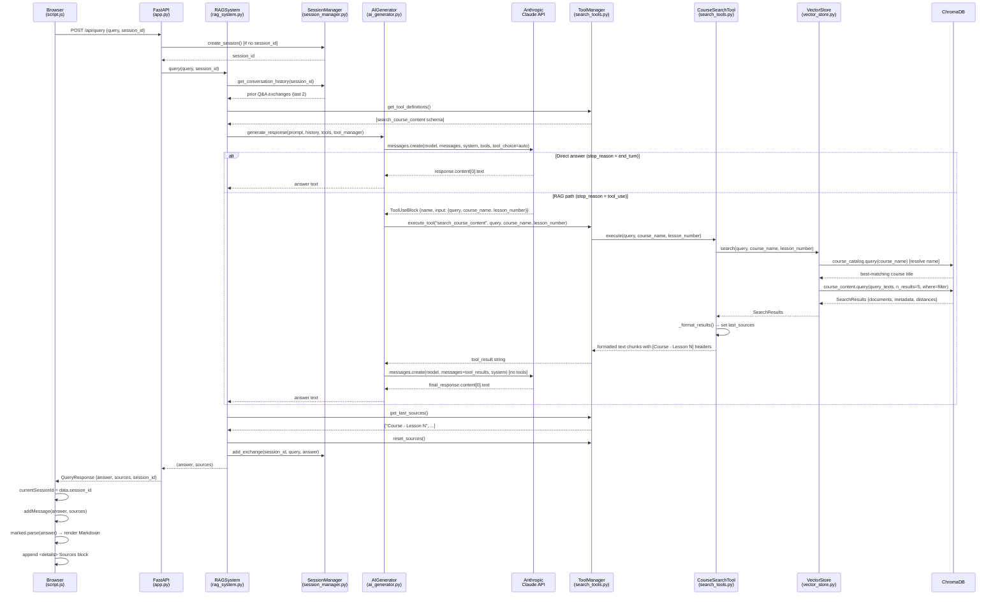

# RAG Chatbot — Codebase Overview Notes

> Internal education document. Covers what this application is, how it is structured, how documents are processed, and how a user query travels from the browser through every layer of the backend and back.

---

## 1. Overview & Purpose

This is a **RAG (Retrieval-Augmented Generation) chatbot** built to answer questions about course materials. Instead of relying on an AI model's training data alone, the application first retrieves relevant chunks from your own course documents, then asks Claude to write an answer grounded in that retrieved content.

**The problem it solves:** Course content is specific, proprietary, and not part of any AI's training data. A plain Claude chat would hallucinate answers or say "I don't know." By pairing Claude with a local vector search over your actual documents, answers are accurate, cited, and traceable to source lessons.

**Tech stack at a glance:**
- **Frontend:** Vanilla HTML + JavaScript + CSS (no framework)
- **Backend:** Python, FastAPI
- **Vector database:** ChromaDB (local, persistent on disk)
- **Embedding model:** `sentence-transformers/all-MiniLM-L6-v2` (runs locally, no API cost)
- **AI model:** Anthropic Claude (`claude-sonnet-4-20250514`) via API

---

## 2. Folder Structure & File Roles

```
rag-chatbot-claude-learning/
├── backend/                     # All server-side Python code
│   ├── app.py                   # Web server entry point & API routes
│   ├── config.py                # Centralised settings & env vars
│   ├── rag_system.py            # Main orchestrator — wires everything together
│   ├── vector_store.py          # ChromaDB interface & semantic search
│   ├── document_processor.py   # Reads, parses, and chunks course files
│   ├── ai_generator.py          # Anthropic API wrapper & tool-calling logic
│   ├── session_manager.py       # Per-session conversation history
│   ├── search_tools.py          # Tool definitions & search execution
│   ├── models.py                # Pydantic data models (Course, Lesson, etc.)
│   └── chroma_db/               # ChromaDB persistent storage on disk
├── frontend/
│   ├── index.html               # Chat UI structure (two-panel layout)
│   ├── script.js                # UI behaviour, API calls, response rendering
│   └── style.css                # Dark-theme styling
├── docs/                        # Course content files (plain text)
│   ├── course1_script.txt
│   ├── course2_script.txt
│   ├── course3_script.txt
│   └── course4_script.txt
├── .env                         # API key (not committed)
├── pyproject.toml               # Project dependencies
└── run.sh                       # One-command startup script
```

### What each backend file does

| File | Responsibility |
|---|---|
| `app.py` | Starts the FastAPI server. Defines `/api/query` and `/api/courses` endpoints. Serves the frontend. Loads course docs at startup. |
| `config.py` | Single source of truth for settings: ChromaDB path, which Claude model, embedding model name, chunk size (800 chars), overlap (100 chars), max results (5), max history (2 exchanges). |
| `rag_system.py` | The conductor. Coordinates all other components. `query()` is the main method every request passes through. |
| `document_processor.py` | Opens `.txt` course files, extracts metadata from the header lines, splits content at `Lesson N:` markers, chunks text, returns structured data ready for storage. |
| `vector_store.py` | Wraps ChromaDB. Manages two collections (`course_catalog` and `course_content`). Converts queries to embeddings and returns semantically similar results. |
| `ai_generator.py` | Calls the Anthropic API. Handles the two-turn tool-calling loop: first call (with tools) → execute tools → second call (with results) → final answer. |
| `search_tools.py` | Defines the `search_course_content` tool in the format Claude expects. Executes the search when Claude requests it. Tracks which sources were used. |
| `session_manager.py` | Stores conversation history in memory, keyed by session ID. Trims to the last N exchanges to control token usage. |
| `models.py` | Plain data containers: `Course`, `Lesson`, `CourseChunk`. No business logic — just structure. |

### What each frontend file does

| File | Responsibility |
|---|---|
| `index.html` | Two-panel layout: left sidebar (course stats, suggested questions) and right chat area (message history, input box). |
| `script.js` | Captures user input, sends `POST /api/query`, renders the response as Markdown, shows collapsible source citations, manages session ID across messages. |
| `style.css` | Dark theme (slate/blue). User messages: blue, right-aligned. Assistant messages: grey, left-aligned. Sources: collapsible `<details>` element. |

---

## 3. Key Features

- **Semantic search** over course materials — finds relevant content by *meaning*, not just keyword matching. Asking "how do I connect an agent?" will find chunks about "MCP client setup" even if the words don't overlap.
- **Claude-powered answers** grounded in your actual documents, not hallucinated from training data.
- **Tool calling** — Claude autonomously decides whether to search or answer from general knowledge. General questions ("What is Python?") skip the search entirely.
- **Multi-turn conversation** — session history lets users ask follow-up questions naturally ("What did you mean by that?").
- **Source attribution** — every answer links back to the exact course and lesson it came from.
- **Auto-ingestion** — course docs are loaded from the `docs/` folder automatically at server startup.
- **Persistent vector store** — embeddings survive server restarts (stored on disk in `backend/chroma_db/`).
- **Deduplication** — re-starting the server does not re-index already-loaded courses.

---

## 4. Core Approach: What is RAG?

RAG stands for **Retrieval-Augmented Generation**. It is a two-phase pattern:

```
INDEXING PHASE (runs once at startup)       QUERYING PHASE (runs per question)
────────────────────────────────────        ──────────────────────────────────
Raw .txt course files                       User's question
        │                                           │
        ▼                                           ▼
Parse + split into lessons               Embed the question into a vector
        │                                           │
        ▼                                           ▼
Chunk each lesson (800 chars)            Search ChromaDB for similar vectors
        │                                           │
        ▼                                           ▼
Embed each chunk → vector              Retrieve top-5 matching text chunks
        │                                           │
        ▼                                           ▼
Store vectors in ChromaDB              Send chunks to Claude as context
                                                    │
                                                    ▼
                                        Claude writes a grounded answer
```

**Key insight:** Claude never reads the raw documents directly. It only ever sees small, pre-retrieved chunks that are semantically relevant to the current question. This keeps prompts short, answers focused, and costs low.

**Why not just send all documents to Claude every time?**
Course documents can be tens of thousands of words. Sending all of them with every question would be extremely expensive (token cost), slow, and would dilute Claude's attention. Retrieval selects only the 5 most relevant paragraphs.

---

## 5. Architecture

The backend follows a clean layered design. Each layer calls only the layer below it — no circular dependencies.

```
┌─────────────────────────────────────────────────────────┐
│                  Frontend (Browser)                     │
│         index.html · script.js · style.css              │
│         Chat UI — sends POST /api/query                 │
└───────────────────────────┬─────────────────────────────┘
                            │ HTTP
┌───────────────────────────▼─────────────────────────────┐
│                  app.py  (FastAPI)                      │
│   Receives requests · creates sessions · serves UI      │
└───────────────────────────┬─────────────────────────────┘
                            │
┌───────────────────────────▼─────────────────────────────┐
│              rag_system.py  (Orchestrator)              │
│      The only file that calls everything else           │
└──────┬──────────────┬───────────────────────────────────┘
       │              │
       ▼              ▼
session_          ai_generator.py           document_processor.py
manager.py        (Claude API wrapper)      (parse + chunk at startup)
(history)               │                           │
                        ▼                           ▼
                  search_tools.py           vector_store.py
                  (tool definitions)        (ChromaDB)
                        │
                        ▼
                  vector_store.py  ◄── (also called directly by search tools)
                  (executes search)
```

**Two Claude API calls happen per course-related question:**
1. **First call** — Claude receives the question + tool definitions. It decides to call `search_course_content` and returns parameters for the search.
2. **Second call** — Claude receives the original question + the retrieved chunks. It writes the final natural language answer.

---

## 6. Document Processing Pipeline

This section explains how raw `.txt` course files are transformed into searchable vector chunks.

### Required file format

Each course file must follow a specific structure that the parser depends on:

```
Course Title: Building with MCP
Course Link: https://example.com/course
Course Instructor: Jane Smith

Lesson 0: Introduction
Lesson Link: https://example.com/lesson-0
[lesson content...]

Lesson 1: Core Concepts
Lesson Link: https://example.com/lesson-1
[lesson content...]
```

### Stage 1 — Parse (`document_processor.py`)

The processor reads the first 3–4 lines to extract **course-level metadata** (title, link, instructor), then scans the rest of the file for `Lesson N:` markers to identify where each lesson begins and ends.

### Stage 2 — Chunk

Each lesson's text is split into overlapping chunks to balance context size with retrieval precision:

```
chunk_size    = 800 characters
chunk_overlap = 100 characters

Lesson text:  [────────────────────────────────────────────────────]
Chunk 1:      [═══════════════════]
Chunk 2:                 [═══════════════════]   ← 100-char overlap
Chunk 3:                            [═══════════════════]
```

Splitting is **sentence-aware** (regex on `.`, `?`, `!`) so chunks never break mid-sentence. The 100-char overlap ensures no context is lost at chunk boundaries.

Each chunk is tagged with metadata: `course_title`, `lesson_number`, `lesson_title`, `course_link`, `lesson_link`.

### Stage 3 — Embed & Store (`vector_store.py`)

Each chunk is converted to a **384-dimensional vector** using `sentence-transformers/all-MiniLM-L6-v2`. This model runs entirely locally — no API call, no cost.

ChromaDB stores **two separate collections:**

| Collection | Contains | Used for |
|---|---|---|
| `course_catalog` | One entry per course (title, instructor, links, lesson list) | Fuzzy course name resolution |
| `course_content` | One entry per chunk (text + embedding + metadata) | Semantic search at query time |

### Stage 4 — Deduplication (`rag_system.py`)

Before storing, `add_course_folder()` checks if the course title already exists in `course_catalog`. If it does, the file is skipped — so restarting the server does not re-index everything.

---

## 7. Query Lifecycle

Here is a step-by-step trace of what happens when a user types a question and presses Send.

### Phase 1 — User sends the query (browser → `app.py`)

1. User types a question in the chat input and clicks Send.
2. `sendMessage()` in `script.js` fires, disables the UI, and appends a loading bubble.
3. A `POST /api/query` request is sent with `{ query, session_id }`. On the first message, `session_id` is `null`.
4. FastAPI routes this to `query_documents()` in `app.py`.
5. If no `session_id` was provided, `session_manager.create_session()` creates a new one (e.g. `"session_1"`).

### Phase 2 — Context assembly (`rag_system.py`)

6. `rag_system.query(query, session_id)` is called.
7. `session_manager.get_conversation_history(session_id)` retrieves the last 2 Q&A exchanges (if any exist) as formatted text.
8. The prompt is wrapped: `"Answer this question about course materials: {query}"`.
9. `tool_manager.get_tool_definitions()` returns the JSON schema for the `search_course_content` tool.

### Phase 3 — First Claude API call (`ai_generator.py`)

10. `ai_generator.generate_response(prompt, history, tools, tool_manager)` is called.
11. The system prompt is constructed: base instructions + optional conversation history appended.
12. `client.messages.create(...)` is called with `tool_choice: "auto"` — Claude decides whether to use a tool.

**Decision point — Claude evaluates the question:**

### Phase 4a — Direct answer path (no search needed)

If `response.stop_reason == "end_turn"`, Claude answered directly from general knowledge.
- `response.content[0].text` is returned immediately.
- Skip to Phase 6.

### Phase 4b — RAG path (Claude invokes the search tool)

If `response.stop_reason == "tool_use"`, Claude returned a `ToolUseBlock` with search parameters.

13. `_handle_tool_execution()` takes over.
14. The assistant's tool-use response is appended to the message history.
15. For each `tool_use` block in the response, `tool_manager.execute_tool("search_course_content", query, course_name, lesson_number)` is called.
16. `CourseSearchTool.execute()` calls `vector_store.search()`.
17. Inside `vector_store.search()`:
    - If `course_name` was provided, `_resolve_course_name()` runs a semantic search against `course_catalog` to find the best-matching course title.
    - `_build_filter()` constructs a ChromaDB `$where` clause (e.g. `{"course_title": "MCP Course"}` or `{"$and": [...]}` for both course and lesson).
    - `course_content.query(query_texts=[query], n_results=5, where=filter)` runs the vector search and returns a `SearchResults` dataclass.
18. `_format_results()` formats the chunks with context headers like `[MCP Course - Lesson 3]` and records `self.last_sources`.
19. Tool results are appended to messages as `{"role": "user", "content": [tool_result, ...]}`.

### Phase 5 — Second Claude API call (tool path only)

20. `client.messages.create(...)` is called again — this time **without** tool definitions, so Claude writes a final answer.
21. `final_response.content[0].text` is returned.

### Phase 6 — Finalise and respond (`rag_system.py` → `app.py`)

22. `tool_manager.get_last_sources()` collects source labels (e.g. `["MCP Course - Lesson 3", "MCP Course - Lesson 5"]`).
23. `tool_manager.reset_sources()` clears them for the next query.
24. `session_manager.add_exchange(session_id, query, response)` stores the Q&A pair (trimmed to last 2 exchanges).
25. `app.py` returns `QueryResponse(answer=..., sources=[...], session_id=...)` as JSON.

### Phase 7 — Response rendered in the browser (`script.js`)

26. `script.js` receives `{ answer, sources, session_id }`.
27. If this was the first message, `currentSessionId` is set from `data.session_id` and reused for all future messages in this session.
28. `addMessage(answer, 'assistant', sources)` renders the answer through `marked.parse()` (Markdown → HTML).
29. If sources are present, a collapsible `<details>` element is appended showing which lessons were cited.
30. The UI is re-enabled and the input is focused.

---

## 8. Query Flow Diagram

The diagram below shows both paths — direct answer and RAG/tool-use — in a single sequence. The `alt` block marks where the two paths diverge.



---

## 9. Key Considerations

### What works well

| Aspect | Detail |
|---|---|
| **Separation of concerns** | Each file does exactly one thing. Swapping ChromaDB for Pinecone, or Claude for another model, would touch only one file each. |
| **Local embeddings** | `all-MiniLM-L6-v2` runs on-device — no embedding API cost, no external latency for that step. |
| **Intelligent routing via tool calling** | Claude decides whether to search, rather than always searching. General questions ("What is Python?") skip retrieval entirely, saving latency and cost. |
| **Source attribution** | Sources are tracked through `ToolManager.last_sources` and returned alongside every answer — critical for trust and debugging. |
| **Persistent storage** | ChromaDB writes to disk, so indexed content survives server restarts without re-processing. |

### Current limitations

| Limitation | Detail |
|---|---|
| **In-memory sessions** | `SessionManager` stores history in a Python dict. Server restart wipes all active sessions. |
| **Short conversation window** | Only the last 2 Q&A pairs are sent to Claude. Users lose context in long conversations. |
| **Rigid document format** | `document_processor.py` depends on exact `Course Title:` / `Lesson N:` structure. A differently formatted file will parse incorrectly or silently drop content. |
| **No authentication** | Any user who can reach the server can query all course data. |
| **Temperature = 0** | Deterministic responses are good for factual Q&A but every call to the same question returns the same wording. |
| **Chunk size is a tuning knob** | 800 chars is a reasonable starting point, but not empirically validated. Too small fragments context; too large introduces noise into Claude's prompt. |
| **Single-collection search** | All course content lives in one ChromaDB collection. At very large scale (thousands of courses), more granular partitioning may be needed. |

---

*Last updated: March 2026*
